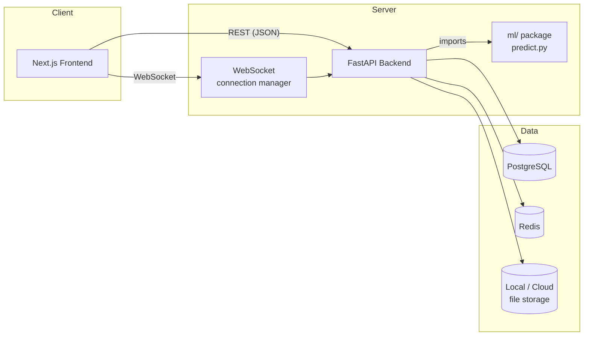
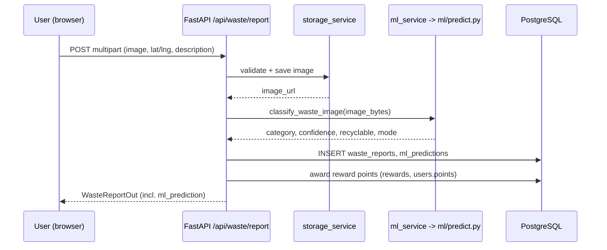

# Architecture

## Overview

EcoTrack is a three-tier application: a Next.js frontend, a FastAPI backend, and a
standalone `ml/` package used for waste-image classification. PostgreSQL is the
system of record; Redis is wired in for caching / future background job use.

## Why this stack

- **Next.js + TypeScript**: type-safe frontend, file-based routing, good DX for a
  CSE portfolio project without unnecessary complexity.
- **FastAPI**: async-capable, automatic OpenAPI docs, Pydantic validation.
- **PostgreSQL**: relational integrity for users/reports/pickups/rewards, which are
  inherently relational (foreign keys everywhere).
- **Redis**: included per the spec for caching/background-job readiness; the base
  app works without it being exercised, so it doesn't block a first run.
- **Standalone `ml/` package**: kept separate from `backend/app` so the classifier
  can be trained, evaluated and swapped independently of the API layer. The
  backend only ever calls `ml.predict.classify_image()`.

## Request flow: waste report submission

## Module boundaries

- `backend/app/api/routes/*` — HTTP layer only: parse request, call a service,
  shape the response. No business logic here.
- `backend/app/services/*` — business logic (ML dispatch, storage, rewards,
  duplicate detection, notifications). Routes call services, not models directly
  for anything non-trivial.
- `backend/app/models/*` — SQLAlchemy ORM models = the schema.
- `backend/app/schemas/*` — Pydantic request/response contracts.
- `ml/` — fully independent of the backend's web framework; could be reused by a
  CLI tool or a different service without any FastAPI dependency.

## Real-time updates

A lightweight in-process `ConnectionManager` (`backend/app/api/routes/ws.py`) keeps
a per-user list of open WebSocket connections. `notification_service.notify_user()`
writes a `Notification` row and, if that user has a live socket, pushes the same
message immediately. This is sufficient for a single backend instance; scaling to
multiple instances would mean backing the connection registry with Redis pub/sub
(the `REDIS_URL` is already configured for exactly this).
