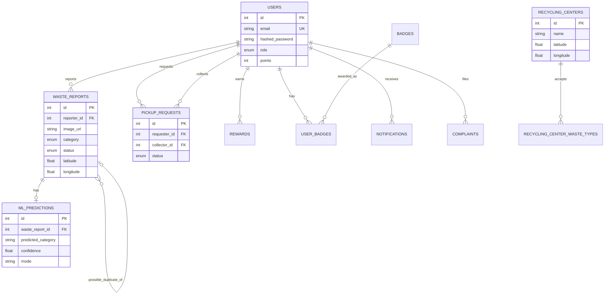

# Database

PostgreSQL, accessed through SQLAlchemy models in `backend/app/models/`. The
source of truth for the schema is the Alembic migration history in
`backend/alembic/versions/`; `database/schema.sql` is a plain-SQL reference copy
of the same schema for quick reading.

## Entity-relationship overview



## Tables

| Table | Purpose |
|---|---|
| `users` | Citizens, collectors, admins. Role-based via `role` enum. |
| `waste_reports` | A citizen-submitted waste report with location + image. |
| `ml_predictions` | 1:1 with `waste_reports` — the classifier's output for that image. |
| `pickup_requests` | A scheduled pickup, with a status state machine (see below). |
| `recycling_centers` / `recycling_center_waste_types` | Centers and the waste types each accepts (many-to-many via the join table). |
| `rewards` | Auditable log of every point-earning event (not just a running total). |
| `badges` / `user_badges` | Badge catalog and which users have earned which. |
| `notifications` | Per-user notification feed. |
| `complaints` | Free-form user complaints/tickets. |
| `activity_logs` | Generic audit trail hook for future use. |

## Pickup status state machine

```
PENDING → ASSIGNED → ACCEPTED → PICKED_UP → COMPLETED
   ↓          ↓           ↓
CANCELLED  CANCELLED  CANCELLED
```

Enforced in `backend/app/api/routes/pickups.py` via `ALLOWED_TRANSITIONS` — the
API rejects any status update that isn't a valid forward transition.

## Migrations

```bash
cd backend
alembic upgrade head                          # apply all migrations
alembic revision --autogenerate -m "message"   # generate a new migration after model changes
alembic downgrade -1                           # roll back one migration
```

The initial migration (`alembic/versions/*_initial_schema.py`) was generated with
`alembic revision --autogenerate` against the actual SQLAlchemy models and verified
to apply cleanly, creating all 13 tables.
